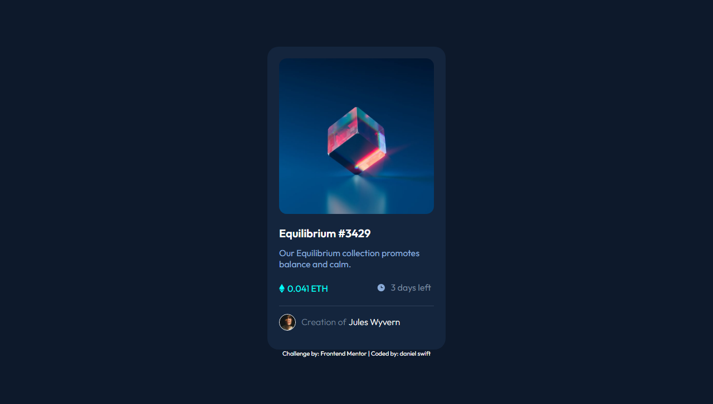

# Frontend Mentor - NFT preview card component solution

This is a solution to the [NFT preview card component challenge on Frontend Mentor](https://www.frontendmentor.io/challenges/nft-preview-card-component-SbdUL_w0U). Frontend Mentor challenges help you improve your coding skills by building realistic projects. 

## Overview

### Screenshot

### Links

- Solution URL: [nft-preview-card-component](https://www.frontendmentor.io/solutions/nft-preview-card-component-B1bk8pFV5)
- Live Site URL: [swift-nft-preview-card-component](https://swift-nft-preview-card-component.netlify.app/)

## My process

### Built with

- Semantic HTML5 markup
- CSS custom properties
- Flexbox

### Useful resources

[Frontend Mentor] - (https://www.frontendmentor.io/) - Improve your Front-End skills my building projects

## Author

- Website - [danielswift10](https://github.com/danielswift10)
- Frontend Mentor - [@danielswift10](https://www.frontendmentor.io/profile/danielswift10)
- Twitter - [@swift_fingers_](https://twitter.com/swift_fingers_)
